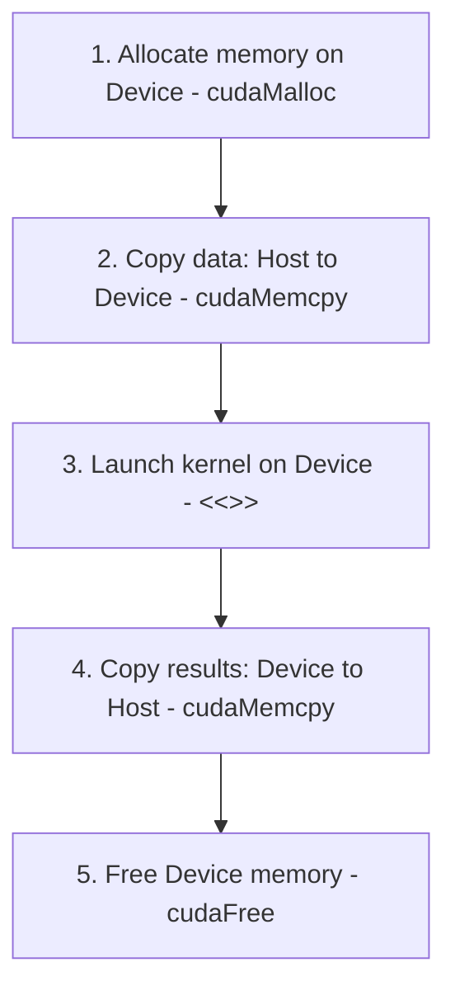

# Module 01 — GPU Fundamentals

> **Estimated time:** ~2 hours  
> **Prerequisites:** None  
> **Next module:** [Module 02 — cpp-basics](../module-02-cpp-basics/README.md)

---

## What You Will Learn

- The big picture: Why GPUs exist and the core differences between CPU and GPU architectures.
- The CUDA thread hierarchy (Grid → Block → Thread) and thread ID calculations.
- Execution model: Warps, Single Instruction Multiple Threads (SIMT), and warp divergence.
- Parallel execution: Amdahl's law, heterogeneous programming, and the 5-step CUDA workflow.
- GPU Memory Hierarchy and the critical role of Shared Memory (`__syncthreads()`).
- GPU Architecture: Streaming Multiprocessors (SMs) and GPU Occupancy.
- Deep Learning performance fundamentals: Memory-limited vs. Math-limited operations, and arithmetic intensity.
- Common GPU programming mistakes and a quick reference cheatsheet.

---

## 1. The Big Picture — Why GPUs Exist

For decades, CPU performance scaled sequentially by increasing clock speed. Around 2005, chip manufacturers hit a physical wall (the "power wall"): increasing clock speed further would melt the silicon. The solution was parallelism: putting more cores on a single chip.

While CPUs scale with 8 to 64 highly sophisticated cores, GPUs take this to the extreme by packing thousands of simpler cores. Originally built to handle millions of pixels independently for graphics rendering, engineers realized this massively parallel architecture is perfect for general-purpose parallel computation, including Machine Learning (ML), physics simulation, and scientific computing. NVIDIA introduced **CUDA** (Compute Unified Device Architecture) in 2007 to allow developers to program GPUs for general computation.

---

## 2. CPU vs. GPU — The Core Difference

Consider this analogy: You need to add a number to 1 million pairs of numbers.

*   **CPU:** A team of **8 brilliant professors**. Each professor is incredibly smart and can solve complex, multi-step problems, handle logic branching, exceptions, and manage memory. However, to add 1 million pairs, they must split the load ($8 \text{ professors} \times 125,000 \text{ pairs each}$) and process them sequentially. The process is latency-bound.
*   **GPU:** An army of **10,000 students**. Each student is simpler and can only do basic tasks. But they all work at *exactly the same time* on different data ($10,000 \text{ students} \times 100 \text{ pairs each}$). The task is completed simultaneously, achieving up to **100x speedup**.

### Detailed Spec Comparison

| Property | CPU (e.g., Intel i9) | GPU (e.g., NVIDIA RTX 4090) |
| :--- | :--- | :--- |
| **Cores** | 8 – 64 cores | 16,384 CUDA cores |
| **Clock Speed** | ~5 GHz (very fast per core) | ~2.5 GHz (moderate per core) |
| **Design Goal** | Low Latency (finish 1 task fast) | High Throughput (finish many tasks/second) |
| **Cache** | Large (MBs per core) | Small (shared across cores) |
| **Branch Handling** | Excellent (advanced branch prediction) | Poor (all threads in a warp must follow the same path) |
| **Memory** | RAM (32 – 128 GB) | VRAM (8 – 80 GB) |
| **Memory Bandwidth**| ~80 GB/s | ~1 TB/s |
| **Best For** | OS, games, web servers, databases | ML, rendering, simulations, vector/matrix math |

> [!NOTE]
> **Key Insight:** CPUs minimize **latency** (time to finish ONE task), whereas GPUs maximize **throughput** (tasks finished PER SECOND). CUDA allows you to write programs that exploit GPU throughput.

---

## 3. Threads — The Workers of CUDA

In standard CPU programming, a thread is a sequence of instructions running on one CPU core. In CUDA, a thread is the smallest unit of work, executed by one GPU core. The difference is scale: CUDA launches millions of threads simultaneously.

### 3.1 CUDA Thread Hierarchy

CUDA organizes threads into a 3-level hierarchy to map work efficiently:

| Level | CUDA Term | Army Analogy | Size / Limits |
| :--- | :--- | :--- | :--- |
| **Smallest** | **Thread** | Soldier | 1 unit of work |
| **Medium** | **Block** | Platoon | Up to 1024 threads |
| **Largest** | **Grid** | Entire Army | Millions of threads |

### 3.2 Thread ID Calculation

Every thread automatically gets a unique ID based on its position in the grid and block. This is the magic of CUDA: you write the kernel code *once*, and each thread runs it on a different slice of data using its unique ID.

CUDA provides three built-in variables for index calculation:
- `threadIdx.x`: The thread's position *within* its current block (0 to 1023).
- `blockIdx.x`: The ID of the block *within* the grid (0 to N).
- `blockDim.x`: The number of threads in one block.

#### Calculation Formula:
```c
int global_id = blockIdx.x * blockDim.x + threadIdx.x;
```

#### Visualization (with `blockDim.x = 4`):
*   **Block 0:** threads 0, 1, 2, 3 $\rightarrow$ `global_id` = 0, 1, 2, 3
*   **Block 1:** threads 0, 1, 2, 3 $\rightarrow$ `global_id` = 4, 5, 6, 7
*   **Block 2:** threads 0, 1, 2, 3 $\rightarrow$ `global_id` = 8, 9, 10, 11

### 3.3 Concrete Example: Array Addition

Instead of a sequential CPU loop, CUDA launches 1 million threads, each adding ONE pair of numbers.

```c
// CPU Version — Sequential (takes N steps)
void add_cpu(float* A, float* B, float* C, int N) {
    for (int i = 0; i < N; i++) {
        C[i] = A[i] + B[i];
    }
}

// GPU Version — Parallel (1 million threads at the same time)
__global__ void add_gpu(float* A, float* B, float* C, int N) {
    int i = blockIdx.x * blockDim.x + threadIdx.x; // Unique global ID
    if (i < N) { // Bounds check!
        C[i] = A[i] + B[i];
    }
}

// Launching the GPU kernel from the CPU Host:
int threads = 256;
int blocks = (N + threads - 1) / threads; // Ceiling division
add_gpu<<<blocks, threads>>>(A, B, C, N);
```

---

## 4. Warps — The Real Execution Unit

Threads in a block do not run entirely independently. The GPU hardware groups threads in a block into units of **32 threads** called **warps**. Warps are the actual execution units on the Streaming Multiprocessor (SM).

A warp executes using the **SIMT (Single Instruction, Multiple Threads)** model. This means all 32 threads in a warp execute the same instruction simultaneously.

### Warp Divergence (The Classic GPU Mistake)

When threads inside a single warp take different paths in a conditional branch (`if-else`), they cannot execute in parallel. The GPU must serialize execution of each path:

```c
__global__ void bad_kernel(int* data) {
    int i = threadIdx.x;
    if (data[i] > 0) {
        do_something(data[i]); // Threads 0-15 execute; Threads 16-31 wait (idle)
    } else {
        do_other(data[i]);    // Threads 16-31 execute; Threads 0-15 wait (idle)
    }
    // Wastes 50% of the warp capacity!
}
```

> [!IMPORTANT]
> **Rule:** All 32 threads in a warp MUST follow the same code path for maximum efficiency. Avoid branching logic (`if-else`) where adjacent threads take different paths.

---

## 5. Parallel Computing — The CUDA Way

### 5.1 What Makes a Problem Parallelisable?

Not every task is suitable for a GPU. The key requirement is that a problem can be split into **independent sub-tasks**.

| Problem | Parallelisable? | Why |
| :--- | :--- | :--- |
| **Add 1M numbers (pairwise)** | **YES** | Each addition is independent of the others. |
| **Matrix multiplication** | **YES** | Each output cell is calculated independently. |
| **Training neural networks** | **YES** | Requires millions of independent weight updates. |
| **Image filtering / Conv** | **YES** | Each pixel is processed independently. |
| **Fibonacci sequence** | **NO** | Each number depends on the previous two (sequential). |
| **Sorting (naive)** | **NO** | Element comparisons depend on each other. |
| **Web server routing** | **NO** | Highly complex, individual logic paths per request. |

### 5.2 Amdahl's Law — The Limit of Parallelism

Even if 95% of your code is parallel, the remaining 5% of sequential code limits your overall speedup.

$$\text{Max Speedup} = \frac{1}{\text{Serial Fraction}}$$

*   If **5%** of the code is sequential $\rightarrow$ Max Speedup = $1 / 0.05 = \mathbf{20x}$ (Even with infinite cores).
*   If **1%** of the code is sequential $\rightarrow$ Max Speedup = $1 / 0.01 = \mathbf{100x}$.
*   If **50%** of the code is sequential $\rightarrow$ Max Speedup = $1 / 0.5 = \mathbf{2x}$ (GPU barely helps).

### 5.3 The CUDA Programming Model

CUDA uses a **heterogeneous model** where the CPU and GPU work together:
- **Host (CPU):** Manages memory, coordinates execution flow, and launches kernels.
- **Device (GPU):** Receives data from the host and executes massively parallel kernels.

#### The 5-Step CUDA Workflow:


### Complete Vector Addition Program

```c
#include <stdio.h>
#include <cuda_runtime.h>

__global__ void vectorAdd(float* A, float* B, float* C, int N) {
    int i = blockIdx.x * blockDim.x + threadIdx.x;
    if (i < N) {
        C[i] = A[i] + B[i];
    }
}

int main() {
    int N = 1024 * 1024; // 1 Million elements
    size_t bytes = N * sizeof(float);

    // Allocate Host (CPU) memory
    float *h_A = (float*)malloc(bytes);
    float *h_B = (float*)malloc(bytes);
    float *h_C = (float*)malloc(bytes);

    for (int i = 0; i < N; i++) {
        h_A[i] = 1.0f;
        h_B[i] = 2.0f;
    }

    // 1. Allocate Device (GPU) memory
    float *d_A, *d_B, *d_C;
    cudaMalloc(&d_A, bytes);
    cudaMalloc(&d_B, bytes);
    cudaMalloc(&d_C, bytes);

    // 2. Copy data Host -> Device
    cudaMemcpy(d_A, h_A, bytes, cudaMemcpyHostToDevice);
    cudaMemcpy(d_B, h_B, bytes, cudaMemcpyHostToDevice);

    // 3. Launch kernel
    int threadsPerBlock = 256;
    int blocksPerGrid = (N + threadsPerBlock - 1) / threadsPerBlock;
    vectorAdd<<<blocksPerGrid, threadsPerBlock>>>(d_A, d_B, d_C, N);

    // 4. Copy results Device -> Host
    cudaMemcpy(h_C, d_C, bytes, cudaMemcpyDeviceToHost);
    printf("h_C[0] = %f (Should be 3.0)\n", h_C[0]);

    // 5. Cleanup
    cudaFree(d_A); cudaFree(d_B); cudaFree(d_C);
    free(h_A); free(h_B); free(h_C);
    return 0;
}
// Compile: nvcc vector_add.cu -o vector_add
// Run: ./vector_add
```

---

## 6. GPU Memory Hierarchy

Memory bandwidth is the #1 performance factor in CUDA. Moving data between the GPU cores and memory has distinct latencies:

| Memory Type | Size | Speed | Scope | Lifetime |
| :--- | :--- | :--- | :--- | :--- |
| **Registers** | ~256 KB per SM | **Fastest** (on-chip) | 1 Thread | Thread lifetime |
| **Shared Memory / L1**| 48 – 164 KB per SM | **Fast ~10 TB/s** (on-chip)| 1 Block | Block lifetime |
| **Constant Memory** | 64 KB | **Cached fast** (read-only) | All threads | App lifetime |
| **Global Memory** | 8 – 80 GB | **Slow ~600-1000 GB/s** (DRAM)| All threads | App lifetime |

### Shared Memory — The Critical Optimization

Shared memory acts like a **fast whiteboard inside a classroom (block)**. Threads within the same block can share data and avoid reading repeatedly from slow Global Memory.

#### Shared Memory Tiling Example (Matrix Multiplication)

```c
__global__ void matMul_shared(float* A, float* B, float* C, int N) {
    __shared__ float tile_A[16][16];
    __shared__ float tile_B[16][16];

    int row = blockIdx.y * 16 + threadIdx.y;
    int col = blockIdx.x * 16 + threadIdx.x;
    float sum = 0.0f;

    for (int t = 0; t < N/16; t++) {
        // Load data once into shared memory tiles
        tile_A[threadIdx.y][threadIdx.x] = A[row * N + t*16 + threadIdx.x];
        tile_B[threadIdx.y][threadIdx.x] = B[(t*16 + threadIdx.y)*N + col];

        // Wait for all threads in the block to finish loading
        __syncthreads();

        // Perform computation using fast shared memory
        for (int k = 0; k < 16; k++) {
            sum += tile_A[threadIdx.y][k] * tile_B[k][threadIdx.x];
        }

        // Wait before loading the next tile
        __syncthreads();
    }
    C[row * N + col] = sum;
}
```

> [!IMPORTANT]
> `__syncthreads()` acts as a block-level barrier. **ALL** threads in the block must reach this line before **ANY** are allowed to proceed. This prevents race conditions.

---

## 7. Streaming Multiprocessors (SM) & GPU Architecture

A GPU is organized into hardware blocks called **Streaming Multiprocessors (SMs)**. Each SM operates as a mini-processor with its own scheduler, shared memory, and execution cores.

### RTX 4090 Architecture Breakdown:
- **128 Streaming Multiprocessors (SMs)**
- Each SM contains:
  - 128 CUDA cores
  - 64 KB shared memory / L1 Cache
  - 32 Warp schedulers
  - Registers (256 KB)
- **Total Cores:** $128 \text{ SMs} \times 128 \text{ cores/SM} = \mathbf{16,384 \text{ CUDA Cores}}$

### GPU Occupancy

**Occupancy** is the ratio of active warps per SM to the maximum number of warps supported by the SM.
- Higher occupancy helps **hide memory latency** by giving the warp scheduler more warps to switch to when one warp is waiting for memory.
- Target occupancy is typically **50% to 75%** (higher is not always possible or beneficial due to register pressure and shared memory limits).

---

## 8. Deep Learning Performance Fundamentals

In Deep Learning, optimizations target three main bounds: **Memory-limited (bandwidth-bound)**, **Math-limited (compute-bound)**, or **Latency-limited**.

### 8.1 Performance Limits Model
Let:
- $T_{mem}$ be the time spent moving data to/from memory.
- $T_{math}$ be the time spent performing mathematical calculations.

Assuming the GPU overlaps memory access with execution, the total execution time is roughly:

$$\text{Execution Time} = \max(T_{mem}, T_{math})$$

### 8.2 Arithmetic Intensity
**Arithmetic Intensity** is the ratio of work (FLOPs) to data volume (bytes accessed):

$$\text{Arithmetic Intensity} = \frac{\text{Floating Point Operations (FLOPs)}}{\text{Memory Accesses (Bytes)}}$$

*   **Math-Limited ($T_{math} > T_{mem}$):** Occurs when arithmetic intensity is *higher* than the processor's capability ratio. Performance scales with core counts and clock speeds. Operations like large Matrix Multiplications (GEMM) are typically math-bound.
*   **Memory-Limited ($T_{mem} > T_{math}$):** Occurs when arithmetic intensity is *lower* than the processor's capability ratio. The processor spends more time waiting for memory transfers. Operations like activations (ReLU, Gelu), element-wise operations (add, scale), and normalization layers (LayerNorm, BatchNorm) are typically memory-bound.
*   **Latency-Limited:** Occurs when there is insufficient parallelism (e.g. tiny batch sizes) to hide instruction or memory latency.

> [!TIP]
> For Deep Learning performance guidelines, refer to the [NVIDIA GPU Performance Background User's Guide](https://docs.nvidia.com/deeplearning/performance/dl-performance-gpu-background/index.html).

---

## 9. Classic CUDA Parallel Patterns

### 9.1 Parallel Reduction (Tree Summation)
To sum an array of numbers, instead of having threads race to write to a single accumulator (race condition), we halve the problem size at each step (a tree reduction):

```c
__global__ void reduce_sum(float* data, float* result, int N) {
    __shared__ float sdata[256];
    int tid = threadIdx.x;
    int i = blockIdx.x * blockDim.x + threadIdx.x;

    sdata[tid] = (i < N) ? data[i] : 0.0f;
    __syncthreads();

    // Tree reduction in shared memory
    for (int s = blockDim.x / 2; s > 0; s >>= 1) {
        if (tid < s) {
            sdata[tid] += sdata[tid + s];
        }
        __syncthreads();
    }

    // Thread 0 writes the block's sum to global memory
    if (tid == 0) result[blockIdx.x] = sdata[0];
}
```

---

## 10. Common Mistakes & How to Fix Them

### 10.1 Forgetting Bounds Checks
If $N$ is not a multiple of the block size, threads at the end of the grid will access out-of-bounds memory.
*   **Wrong:** `A[i] = A[i] * 2;`
*   **Right:** `if (i < N) { A[i] = A[i] * 2; }`

### 10.2 Forgetting `cudaDeviceSynchronize()`
Kernel launches are asynchronous. The CPU launches the kernel and immediately proceeds. Copying results before synchronization yields garbage data.
*   **Wrong:**
    ```c
    myKernel<<<blocks, threads>>>(d_data);
    cudaMemcpy(h_data, d_data, ...); // Kernel might not be finished!
    ```
*   **Right:**
    ```c
    myKernel<<<blocks, threads>>>(d_data);
    cudaDeviceSynchronize(); // Wait for GPU to finish
    cudaMemcpy(h_data, d_data, ...);
    ```

### 10.3 Race Conditions without `__syncthreads()`
If thread A reads shared memory while thread B is writing, the results are undefined.
*   **Wrong:**
    ```c
    sdata[tid] = compute(tid);
    float val = sdata[other_tid]; // Race condition
    ```
*   **Right:**
    ```c
    sdata[tid] = compute(tid);
    __syncthreads(); // Wait for ALL threads to finish writing
    float val = sdata[other_tid];
    ```

---

## 11. CUDA Quick Reference Cheatsheet

| Concept | Syntax / Code | Description / Notes |
| :--- | :--- | :--- |
| **Define kernel** | `__global__ void fn(args)` | Execution entry point on GPU, called from Host (CPU). |
| **GPU helper fn** | `__device__ float fn(args)` | Helper function on GPU, called from GPU only. |
| **Launch kernel** | `fn<<<gridDim, blockDim>>>(args)` | Launches execution grid where `gridDim * blockDim` = total threads. |
| **Thread ID** | `blockIdx.x * blockDim.x + threadIdx.x`| Calculates globally unique ID for a thread. |
| **Memory Alloc** | `cudaMalloc(&ptr, bytes)` | Allocates memory on the GPU Device. |
| **Host to Device**| `cudaMemcpy(d_ptr, h_ptr, bytes, cudaMemcpyHostToDevice)` | Copies data from CPU to GPU. |
| **Device to Host**| `cudaMemcpy(h_ptr, d_ptr, bytes, cudaMemcpyDeviceToHost)` | Copies data from GPU to CPU. |
| **Sync barrier** | `__syncthreads()` | Thread synchronization barrier within a block. |
| **Device Sync** | `cudaDeviceSynchronize()` | Blocks CPU Host execution until all GPU tasks finish. |
| **Shared memory**| `__shared__ float arr[256]` | Fast block-scoped memory. |
| **Max threads** | `1024` | Maximum threads per block (hardware limit). |
| **Warp size** | `32` | Group of threads executing in SIMT lockstep. |
| **Compile** | `nvcc file.cu -o output` | NVIDIA CUDA Compiler command. |

---

## Exercises

See [`../../exercises/module-01/`](../../exercises/module-01/)

## Quiz

See [`../../quizzes/module-01/quiz.md`](../../quizzes/module-01/quiz.md)

---

➡️ **Next:** [Module 02 — CUDA Setup](../module-02-cuda-setup/README.md)
